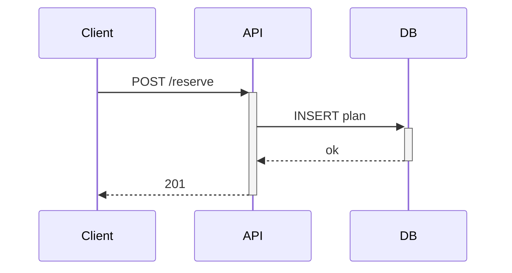

# Visual Studio Code 1.121 — Mermaid / HTML プレビューと Remote Agent

- **日付**: 2026-05-22
- **カテゴリ**: Dev Tool
- **ソース**: [Release Notes](https://code.visualstudio.com/updates/v1_121), [Visual Studio Magazine](https://visualstudiomagazine.com/articles/2026/05/20/vs-code-1-121-adds-remote-agents-built-in-html-and-mermaid-previews.aspx)

## 概要

VS Code 1.121 が 2026-05-20 に Stable へリリースされた。エディタとしての基礎機能 (プレビュー機能) と、エージェント駆動開発の両軸でアップデートが入っているのが特徴。Markdown プレビューに Mermaid を組み込み、ローカル HTML を統合ブラウザでプレビュー可能にし、さらに Agents window から SSH / Dev Tunnel 経由で別マシン上でエージェントセッションを走らせられるようになった。

毎週リリースの一回ではあるが、「拡張で入れていたものが標準化される」「リモート対応で開発機の選択肢が広がる」という観点で日常作業への影響が大きい更新。

## 主な変更点

### Mermaid Markdown Features (組み込み拡張)

Matt Bierner 氏の `Markdown Preview Mermaid Support` 拡張が VS Code 本体にマージされ、`Mermaid Markdown Features` という新しい組み込み拡張として同梱された。

- Markdown プレビューに加え、Notebook の Markdown セル、Chat 出力でも Mermaid をレンダリング
- パン・ズーム操作に対応
- 図を右クリックすると Mermaid ソースをコピー可能

````md

````

### HTML ファイルプレビュー

エクスプローラから直接ローカル HTML を Integrated Browser でプレビューできるようになった。これまで `Live Preview` 等の拡張に依存していた用途が拡張なしで完結する。

### Agents window と Remote Agent (preview)

- Agents window は前リリース (1.120) で Stable に preview 提供されていたものを継続改善
- 1.121 では **Remote Agent (実験)** が追加され、ローカル VS Code から SSH / Dev Tunnel で接続した別マシン上にエージェントセッションを起動できる
- 重い処理やクラウド GPU マシンを使いたいケースで、エディタを離れずに作業を回せる

### ターミナルとエージェントの統合改善

- エージェント実行時には環境変数 `VSCODE_AGENT` をターミナルにセット (シェル設定で条件分岐可能)
- バックグラウンドターミナルを自動でクリーンアップ
- ターミナル出力の圧縮対象範囲を拡大し、長いログでもコンテキストを圧迫しにくく
- Claude Agent が Auto permission mode に対応

### 軽量タスク向けモデル設定

コミットメッセージやタイトル生成など「軽量タスク」に使うモデルを個別に設定できるようになり、BYOK でコスト最適化もしやすくなった。

## 破壊的変更・移行ガイド

破壊的変更は無く、自動更新で恩恵を受けられる。注意点としては、Mermaid 拡張をすでに利用していた場合はバージョンによって組み込み拡張と二重描画になる報告 ([Issue #317517](https://github.com/microsoft/vscode/issues/317517)) があり、不要なら既存拡張を無効化したほうがよい。

## 今後の注目点

- Remote Agent はまだ実験フェーズ。Production utility のためには接続安定性とセッション復旧、コスト可視化が論点
- Mermaid 組み込みは「拡張で機能を試し、本体に取り込む」流れのよい事例。次に取り込まれる候補 (PlantUML, GraphViz など) を Microsoft がどう選別するか
- Agents window の Stable 化は agent ベースのワークフローを「拡張ではなくエディタの一級市民」として扱う方針の明示でもあり、後続バージョンでの Tool 連携 API 整理を追っておきたい
